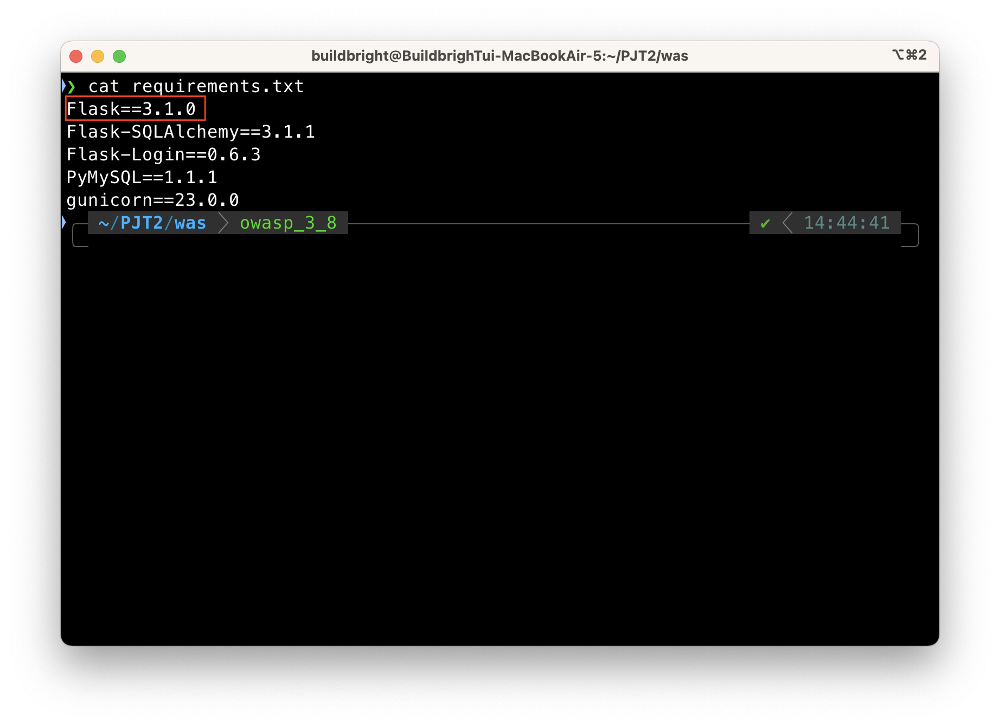
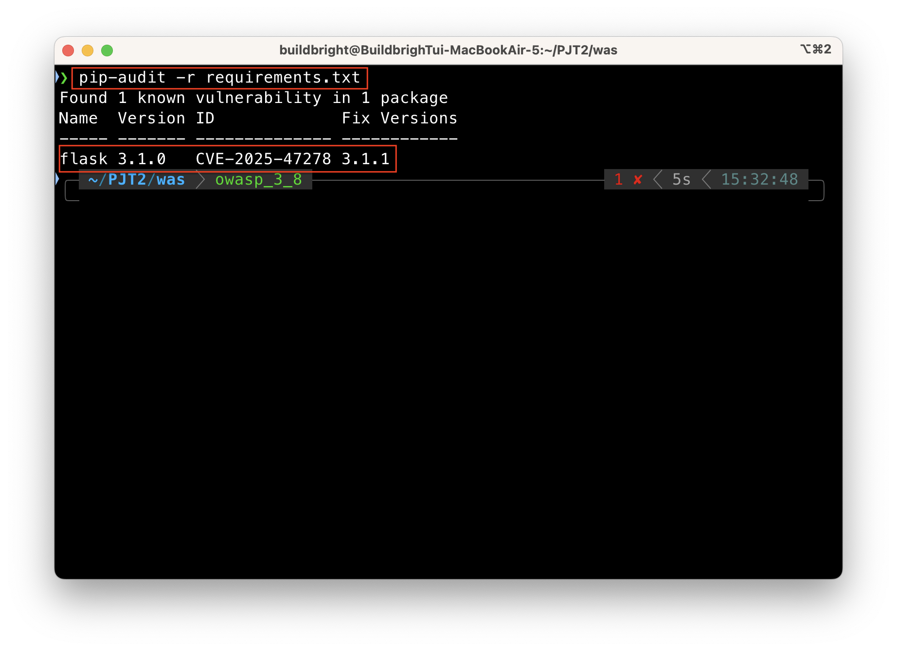
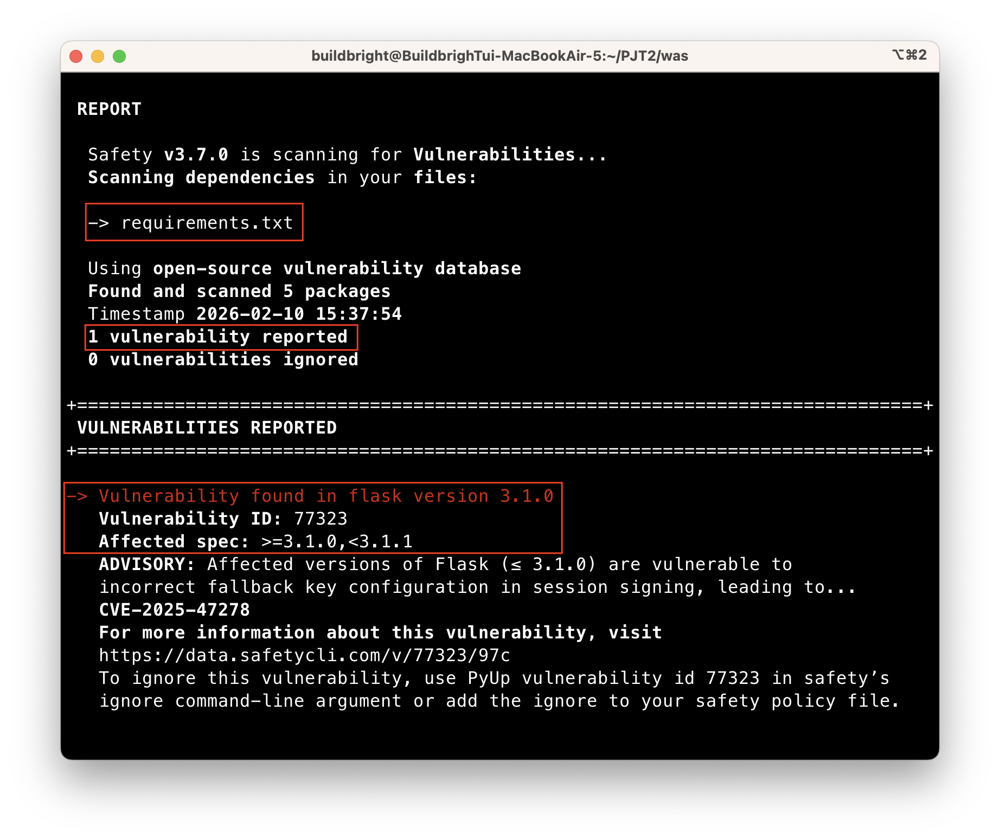
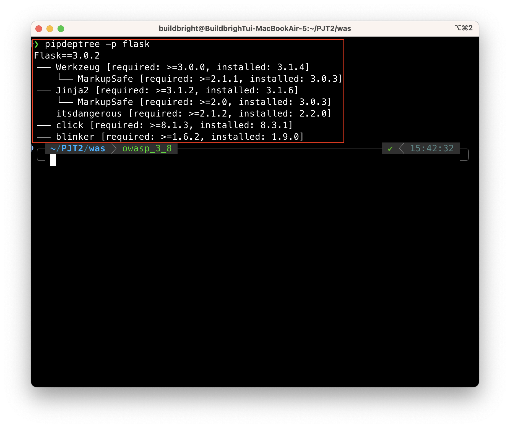
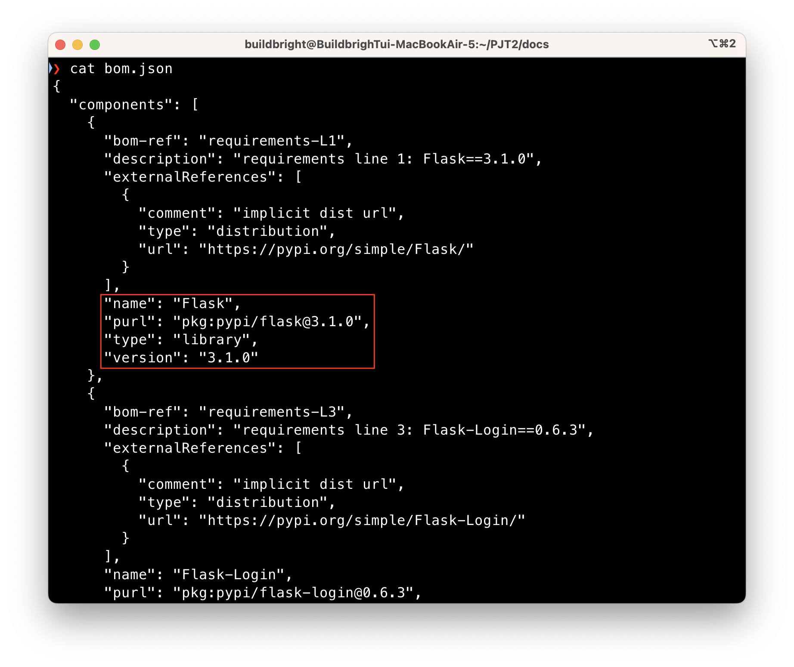
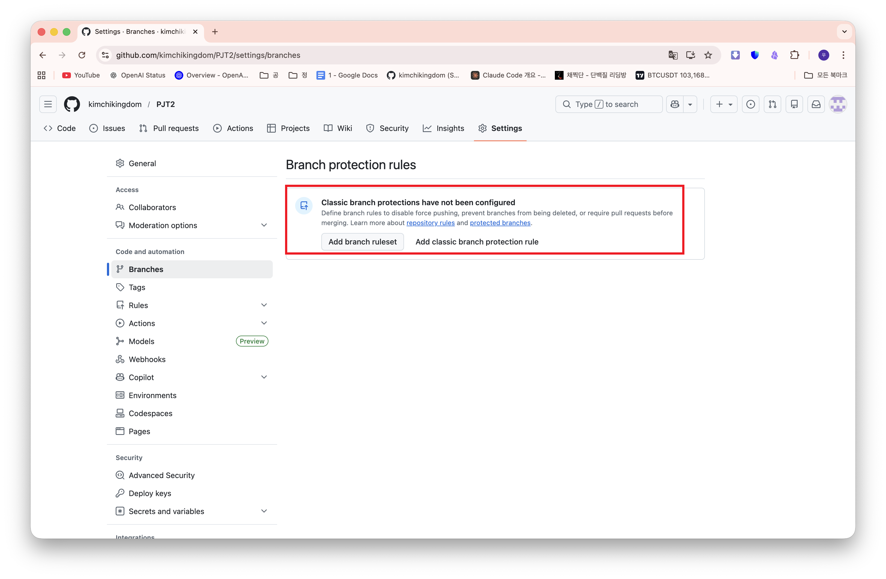
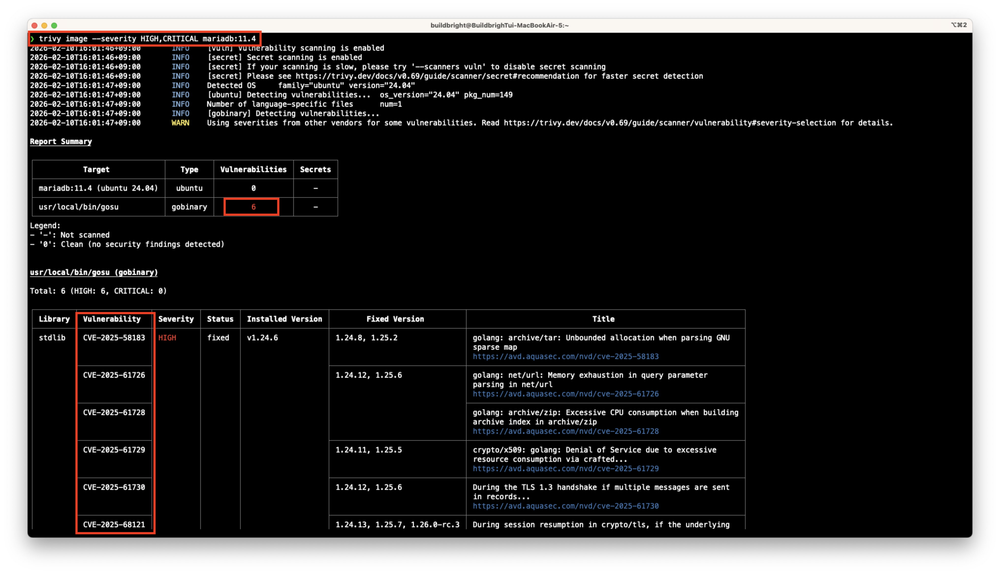
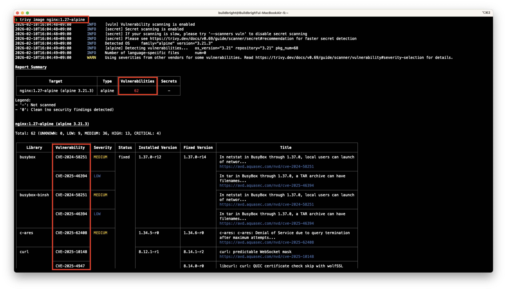
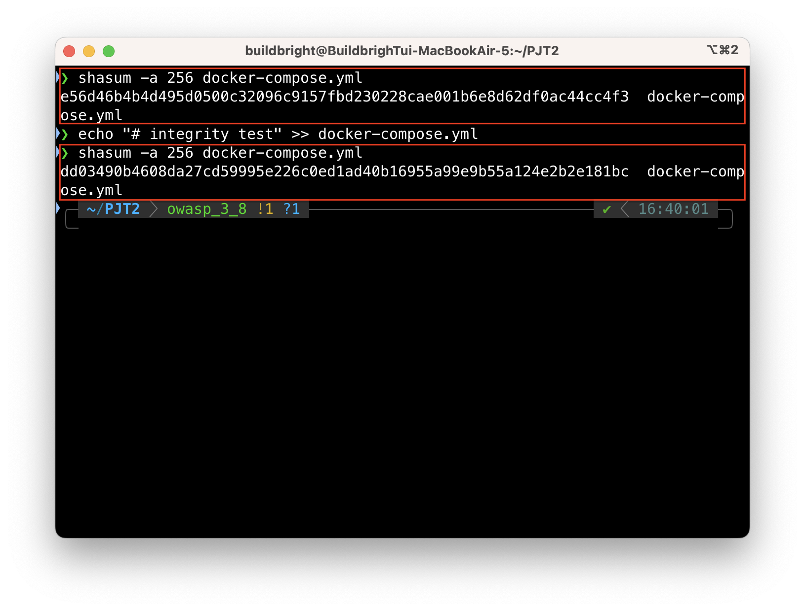
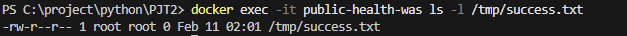

# OWASP 취약점 진단 - A03:2025, A08:2025를 중심으로

## Part 1. 소프트웨어 공급망 보안 결함 및 관리 체계 진단 [A03:2025]

### **1) 의존성 버전 고정 및 관리 적절성**

- **점검 내용**:
  - 프로젝트 루트 내 `was/requirements.txt` 파일을 분석하여 애플리케이션이 사용하는 외부 라이브러리의 관리 정책을 점검함.
  - 버전 고정(Pinning) 여부를 통해 배포 무결성(Integrity) 확보 상태를 확인하고, 최신 보안 패치 적용 프로세스가 공급망 보안 관점에서 적절히 수립되어 있는지 평가함.

- **분석 결과**:

  

      
       
      <b>requirements.txt 내 취약한 라이브러리 버전 고정 현황</b>
  

  - **배포 무결성 사슬의 불완전성**: 모든 주요 라이브러리에 대해 `==` 연산자를 사용해 버전을 고정한 것은 환경 간 **재현성(Reproducibility)** 확보에는 기여하나, 보안 업데이트가 배제된 **'정적인 공급망'**을 형성함.
  - **보안 패치 공백 발생**: 현재 고정된 **Flask 3.1.0** 버전은 `CVE-2025-47278`과 같은 Critical 수준의 취약점이 존재함에도 불구하고, 자동 업데이트 및 검증 프로세스의 부재로 인해 시스템이 지속적으로 위험에 노출되는 **버전 고정의 역설**이 식별됨.
  - **무결성 검증 메커니즘 부재**: 라이브러리 버전만 명시되어 있을 뿐, 해당 패키지의 원본성을 보장하는 **Hash 값(Checksum)** 대조 로직이 누락되어 있어 전송 구간에서의 패키지 변조나 타이포스쿼팅(Typosquatting) 공격에 무방비한 상태임.

- **개선 방안**:
  - **단기 - SCA(Software Composition Analysis) 도입**: `pip-audit` 또는 `Safety`와 같은 도구를 CI/CD 파이프라인에 통합하여 취약한 버전이 포함된 커밋을 자동으로 차단.
  - **중기 - 체크섬 검증(Hash Verification)**: requirements.txt 작성 시 --hash 옵션을 추가하여, 설치 시점에 라이브러리의 무결성을 1비트 단위까지 교차 검증함.
  - **장기: 의존성 갱신 정책 수립**: 분기별 정기 업데이트 외에 Critical CVE 발생 시 24시간 내 패치를 완료하는 **긴급 패치 프로세스** 명문화.

---

### **2) 알려진 취약점이 있는 패키지 사용 여부**

- **점검 내용**:
  - 자동화된 오픈소스 보안 분석(SCA) 도구인 **pip-audit** 및 **safety**를 활용하여 프로젝트 내 `was/requirements.txt`에 명시된 패키지들의 알려진 보안 취약점(CVE) 유무를 전수 조사함.
  - 단순히 취약점의 존재 여부만 확인하는 것을 넘어, 해당 취약점이 실제 서비스 환경에 미칠 수 있는 영향도와 조치 우선순위를 평가함.

- **분석 결과**:

      
       
      <b>pip-audit 스캔을 통한 Flask 패키지 취약점 탐지 결과</b>

    
     
    <b>safety 스캔 결과 및 상세 취약점 정보(CVE-2025-47278) 확인</b>

- **치명적 취약점(Critical CVE) 식별**: 두 도구의 교차 검증 결과, 현재 사용 중인 **Flask 3.1.0** 버전에서 `CVE-2025-47278` 취약점이 공통적으로 식별됨.
- **공급망 보안 위험**: 해당 취약점은 원격 코드 실행(RCE)이나 민감 정보 유출로 이어질 수 있는 고위험군 결함으로, 공격자가 신뢰되지 않은 의존성 경로를 통해 시스템 전체의 무결성을 파괴할 수 있는 '공급망 실패(A03)'의 전형적인 사례임.
- **조치 긴급도**: 실무 관점에서 즉각적인 패치가 필요한 상황이며, 버전 고정 정책이 보안 업데이트의 장애물로 작용하고 있는 상태임.

- **개선 방안**:
  - **의존성 보안 스캔 자동화 (CI/CD 통합)**
    - `pip-audit` 또는 `safety`를 GitHub Actions 등의 CI/CD 파이프라인에 통합하여, 새로운 코드가 푸시될 때마다 의존성 취약점을 자동으로 점검하고 취약점 발견 시 빌드를 즉시 중단(Build Break)하도록 설정함.
  - **동적 패치 및 버전 관리 정책 수립**
    - **분기별 정기 업데이트**: 모든 라이브러리를 최신 안정 버전으로 검토 및 업데이트하는 정기 프로세스를 가동함.
    - **긴급 보안 패치**: Critical 수준의 CVE 공표 시, 24시간 이내에 호환성 테스트 및 패치 적용을 완료하는 긴급 대응 체계를 규정화함.
  - **신뢰할 수 있는 소스 제어 및 화이트리스트 운영**
    - PyPI 등 공식적인 신뢰 소스에서만 패키지를 설치하도록 `pip` 설정(`--index-url`)을 강제하고, 사내에서 검증된 패키지만 사용할 수 있는 프라이빗 리포지토리를 운영하여 공급망의 무결성을 강화함.

---

### **3) 의존성 트리의 간접 의존성 파악**

- **점검 내용**:
  - `pipdeptree` 도구를 활용하여 Flask 등 주요 패키지가 참조하는 **하위 전이 의존성(Transitive Dependencies)**의 계층 구조와 버전 요구사항을 전수 분석함.
  - 직접 관리 대상이 아닌 간접 의존성 패키지들이 전체 소프트웨어 공급망의 무결성에 미치는 잠재적 위협과 버전 충돌(Conflict) 가능성을 평가함.

- **분석 결과**:

      
       
      <b>pipdeptree 분석을 통한 전이 의존성 계층 구조 및 버전 종속성 확인</b>

- **숨겨진 공격 표면(Hidden Attack Surface) 식별**: 분석 결과, Flask는 `Werkzeug(3.1.4)`, `Jinja2(3.1.6)`, `itsdangerous(2.2.0)` 등 다수의 하위 라이브러리에 강하게 의존하고 있음. 이는 직접 의존성 패키지만 관리할 경우, 하위 패키지에서 발생하는 무결성 결함(A08)을 인지하지 못하는 보안 사각지대가 존재함을 시사함.
- **버전 충돌 및 패치 제약 확인**: 특정 보안 취약점 해결을 위해 상위 패키지의 버전을 수정할 경우, `MarkupSafe`와 같은 공통 하위 의존성들 간의 버전 요구사항이 충돌하여 시스템 전체의 가용성이 저해되는 **'의존성 지옥(Dependency Hell)'** 위험이 상존함.
- **공급망 가시성 결여**: 현재 `requirements.txt` 방식은 최하위 라이브러리까지의 무결성을 보장하지 못하며, 빌드 시점에 예기치 않은 하위 패키지 업데이트가 발생할 경우 검증되지 않은 코드가 시스템에 유입될 수 있음.

- **개선 방안**:
  - **SBOM(Software Bill of Materials) 관리 체계 수립**
    - `pipdeptree` 분석 결과를 기반으로 전체 소프트웨어 자재 명세서(SBOM)를 작성하고, 직접/간접 의존성을 포함한 전체 트리에 대해 주기적인 보안 스캔을 수행함.
  - **Lock 파일 도입을 통한 결정적 빌드(Deterministic Build) 구현**
    - `pip freeze`를 넘어 해시(Hash) 값이 포함된 **Lock 파일**(`requirements.txt` 내에 `--hash` 포함 혹은 `Poetry`, `pip-compile` 활용)을 도입함. 이를 통해 모든 하위 의존성 패키지가 단 1비트의 변조 없이 빌드 시점에 동일하게 유지되도록 무결성을 강제함.
  - **의존성 갱신 자동화 및 회귀 테스트**
    - 하위 패키지의 보안 패치 적용 시 발생할 수 있는 버전 충돌을 사전에 탐지하기 위해, 자동화된 회귀 테스트(CI) 환경을 구축하여 공급망의 안전성과 가용성을 동시에 확보함.

---

### **4) SBOM(Software Bill of Materials) 관리 여부**

- **점검 내용**:
  - 소프트웨어 구성 요소의 투명한 파악과 체계적인 관리를 위해 자재명세서(SBOM)의 생성 및 관리 프로세스를 점검함.
 - 글로벌 표준 포맷인 **CycloneDX**를 활용하여 서비스 의존성 리스트가 기계 판독이 가능한(Machine-readable) 형태로 관리되고 있는지, 공급망 공격 발생 시 신속한 추적이 가능한 구조인지 확인함.

- **분석 결과**:

      
       
      <b>CycloneDX 기반 SBOM(bom.json) 생성 및 의존성 명세 확인</b>

- **표준 명세화 성공 및 가시성 확보**: `cyclonedx-py` 도구를 통해 표준 SBOM 파일인 `bom.json` 생성이 가능함을 확인하였으며, 각 라이브러리의 고유 식별자인 **PURL(Package URL)** 정보를 확보하여 공급망 내 개별 컴포넌트에 대한 정밀한 식별이 가능해짐.
- **취약 컴포넌트 즉각 식별**: 생성된 SBOM 분석 결과, 앞서 식별된 취약 버전인 **flask@3.1.0**이 명세서 내에 명확히 기록되어 있어 취약점 관리의 근거 데이터로서의 유효성을 확인함.
- **중앙 관리 체계 및 실시간성 결여**: 현재 SBOM 생성 단계가 개발자의 수동 작업에 의존하고 있어, 대규모 라이브러리 업데이트나 신규 제로데이(Zero-day) 취약점 발생 시 즉각적인 영향도를 파악하기에는 실시간 가시성이 부족한 상태임.

- **개선 방안**:
  - **CI/CD 파이프라인 내 SBOM 자동 생성 및 동기화**
    - 빌드 및 배포 단계마다 SBOM을 자동으로 생성하고 최신화된 `bom.json`을 아티팩트와 함께 관리하여, 소프트웨어 생애 주기 전반에 걸친 무결성을 보장함.
  - **SBOM 전용 관리 플랫폼(Dependency-Track) 도입**
    - 생성된 SBOM을 **Dependency-Track**과 같은 중앙 관리 플랫폼과 API로 연동하여, 수천 개의 의존성 패키지에 대한 취약점 상태를 실시간으로 모니터링하고 경고하는 체계를 구축함.
  - **VEX(Vulnerability Exploitability eXchange) 활용 및 무결성 대조**
    - SBOM 내 기록된 해시(Hash) 값을 실제 라이브러리와 대조하여 변조 여부를 상시 검증하고, **VEX**를 통해 탐지된 취약점이 실제 서비스에 영향을 주는지 여부를 문서화하여 관리 효율성을 극대화함.

---

### **5) CI/CD 파이프라인 접근 제어 및 로깅**

- **점검 내용**:
  - 소스 코드 푸시부터 배포의 시작점인 GitHub 레포지토리의 **브랜치 보호 규칙(Branch Protection Rules)** 및 사용자 권한 할당 상태를 점검함.
  - 비인가자에 의한 코드 강제 푸시(Force Push)나 승인되지 않은 코드의 파이프라인 유입을 차단하는 기술적 통제 장치를 확인함.

- **분석 결과**: 

      
       
      <b>배포 파이프라인 진입점(GitHub 브랜치)에 대한 보호 규칙 및 접근 제어 부재 확인</b>

 

- **통제 장치 부재**: `main` 및 `owasp_3_8` 등 중요 브랜치에 대해 보호 규칙이 설정되어 있지 않음. 이로 인해 코드 리뷰나 관리자 승인 없이 누구나 코드를 수정하고 푸시할 수 있는 **'배포 무결성 사슬'**의 단절이 확인됨.
- **가시성 및 감사 추적 한계**: 빌드 서버 및 배포 환경의 감사 로그(Audit Log)를 일반 개발자나 보안 점검자가 상시 확인할 수 없는 구조임. 이는 공격자가 파이프라인에 침투하여 아티팩트를 변조하더라도 적시에 탐지하기 어렵게 만드는 **보안 사각지대**를 형성함.

- **개선 방안**:
  - **브랜치 보호 규칙 적용**: 중요 브랜치에 대해 `Require a pull request before merging` 옵션을 활성화하여, 최소 1인 이상의 승인이 있어야만 코드가 반영되도록 강제함.
  - **중앙 집중형 로깅 구축**: CI/CD 과정(GitHub Actions, Jenkins 등)에서 발생하는 모든 로그를 별도의 보안 로그 서버(SIEM 등)로 통합하여, 권한이 제한된 점검자도 무결성 이력을 상시 모니터링할 수 있도록 개선함.
  - **강력한 인증 도입**: 파이프라인 접근 권한이 있는 모든 계정에 대해 **다요소 인증(MFA)**을 의무화하여 계정 탈취를 통한 공급망 공격 위험을 최소화함.

---

### **6) Docker 베이스 이미지 취약점 스캔**

- **점검 내용**:
  - 서비스 배포의 기반이 되는 Docker 베이스 이미지(`mariadb:11.4`, `nginx:1.27-alpine`)의 OS 및 런타임 계층에 존재하는 알려진 취약점(CVE)을 점검함.
  - 외부 레지스트리에서 공급받은 이미지가 무결성 검증 없이 배포되어 공급망 공격(A03)의 통로로 활용될 수 있는 위험 요소를 분석함.

- **분석 결과**:

      
       
      <b></b>

- **핵심 라이브러리 결함 식별**: MariaDB 11.4 이미지 스캔 결과, `gosu` 라이브러리 등에서 **6건의 HIGH** 등급 취약점(CVE-2025-58183 등)이 식별됨. 이는 권한 상승이나 컨테이너 탈출로 이어질 수 있는 무결성 위협 요인임.

      
       
      <b></b>

- **경량 이미지의 보안 맹점 확인**: `Nginx 1.27-alpine`의 경우, 공격 표면이 적은 Alpine 기반 이미지를 채택했음에도 불구하고 **총 62건(CRITICAL 4, HIGH 13)**의 대량 취약점이 탐지됨.
- **공급망 관리의 부재**: 단순히 Alpine 이미지를 사용하는 것만으로는 무결성을 보장할 수 없으며, 이미지 생성 시점과 배포 시점 사이의 보안 공백을 메울 수 있는 **상시 스캔 체계**가 부재함을 실증함.

- **개선 방안**:
  - **CI/CD 파이프라인 내 'Trivy' 게이트키핑(Gatekeeping) 도입**
    - 빌드 단계에서 **Trivy**와 같은 취약점 스캐너를 통합하여, 설정된 임계치(예: CRITICAL 1건 이상 발생 시)를 초과하는 이미지는 즉시 배포를 차단하는 자동화된 보안 정책을 수립함.
  - **최소 이미지(Distroless) 및 골든 이미지(Golden Image) 전략 수립**
    - OS 패키지가 최소화된 **Distroless** 이미지를 사용하여 공격 표면을 극한으로 줄이거나, 사내 보안 가이드라인이 적용되어 취약점이 패치된 **표준 골든 이미지**만을 사용하도록 강제함.
  - **이미지 서명 및 무결성 검증(Docker Content Trust)**
    - 스캔이 완료된 정상 이미지에 대해 디지털 서명을 부여하고, 배포 환경에서 서명이 확인된 이미지만 실행되도록 **DCT(Docker Content Trust)** 설정을 활성화하여 공급망 무결성을 확보함.

---

## Part 2. 소프트웨어 및 데이터 무결성 결함 및 변조 통제 체계 진단 [A08:2025]

### **1) 배포 단위 체크섬/서명 사용 여부**

- **점검 내용**:
  - 배포 아티팩트(`docker-compose.yml`)가 빌드 서버에서 운영 환경으로 전달되는 과정에서 위변조되지 않았음을 보장하기 위한 **체크섬(Checksum) 생성 및 검증 절차** 존재 여부를 점검함.
  - 임의의 파일 수정 시 해시값이 변하는지 실증하여, 현재 환경에서의 탐지 가능성을 확인함.

- **분석 결과**:

      
       
      <b>SHA-256 해시값 분석을 통한 배포 파일의 무결성 변조 탐지 실증</b>

- **무결성 기준점 확보**: `shasum -a 256` 명령을 통해 원본 파일의 고유 해시값(`e56d46...`)을 추출함. 
- **변조 탐지 실증**: 파일 끝에 주석(`# integrity test`)을 추가하는 미세한 변경만으로도 해시값이 `dd0349...`로 완전히 변경되는 것을 확인함. 
- **위험 요인**: 분석 결과, 배포 시점에 이러한 체크섬을 자동으로 대조하는 **무결성 검증 프로세스가 부재**함. 이로 인해 공급망 중간 단계에서 공격자가 배포 파일을 악성 이미지로 교체하더라도 이를 인지하지 못하고 배포를 강행할 위험이 존재함.

- **개선 방안**:
  - **CI/CD 파이프라인 내 체크섬 자동 검증**: 빌드 시점에 생성된 해시값을 아티팩트와 함께 배포하고, 운영 서버에서 배포 직전 이를 자동 대조하는 스크립트 도입. 
  - **디지털 서명(Code Signing) 적용**: 단순 해시 대조를 넘어, 신뢰할 수 있는 기관의 인증서로 배포 단위에 서명을 수행하여 출처와 무결성을 동시에 보장함.

---

### **2) 중요 설정 파일 변경 이력 검토**

- **점검 내용**:
  - 인프라 구성의 핵심인 `docker-compose.yml` 파일의 변경 이력을 **Windows PowerShell** 환경에서 정밀 추적하여 비인가 수정 및 비정상적인 설정 변경 여부를 감사함.
  - 설정 파일 내 민감 정보(Password, Secret Key)가 무결성 보호 장치 없이 평문으로 노출되어 있는지 확인하여 **'환경 설정 무결성(Configuration Integrity)'** 수준을 평가함.

- **분석 결과**:

      
       
      <b>PowerShell 기반 git log 분석을 통한 비인가 변경 및 민감 정보 노출 식별</b>

- **변경 이력 추적성(Traceability) 분석:**
  - `git log -p` 분석 결과, 파일 생성자(`kimchikingdom`) 외에 `buildbright`라는 다중 작성자에 의한 수정 이력이 확인됨.
  - 최신 커밋(`1e9cfd5`)에서 `# test`**와 같은 의미 없는 주석**이 추가된 것이 식별됨. 이는 사소한 코드 삽입일지라도 별도의 **승인 프로세스(Code Review)** 없이 메인 브랜치에 즉시 반영될 수 있는 취약한 배포 구조를 증명함.

- **무결성 위협 지점 식별**:
  - **설정 데이터 변조 위험**: `MARIADB_ROOT_PASSWORD: rootpw`, `SECRET_KEY: change-me...` 등의 핵심 데이터가 **평문(Plaintext)**으로 노출됨. 이는 기밀성 실패를 넘어, 비인가자가 설정값을 임의로 변경해도 시스템이 이를 '승인된 변경'과 구분할 수 있는 보호 체계가 부재함을 의미함.
  - **신뢰의 사슬(Chain of Trust) 결여**: 모든 커밋 기록에서 **디지털 서명(GPG Signature)**이 확인되지 않음. 이로 인해 터미널에 표시된 작성자(Author) 정보의 무결성을 보장할 수 없으며, 작성자 위조를 통한 공급망 공격에 무방비한 상태임.

- **개선 방안**:
  - **민감 정보의 격리 및 기밀성·무결성 확보**
    - `docker-compose.yml` 내에 평문으로 노출된 `apppw` 등의 비밀번호를 즉시 제거하고, **Docker Secrets** 또는 암호화된 **Secrets 관리 시스템(Vault 등)**을 도입해야 합니다.
    - 민감 정보를 환경 변수(`.env`)로 분리하되, 해당 파일은 `.gitignore`에 등록하여 원격 저장소에 이력이 남지 않도록 엄격히 통제하여 설정 데이터의 오염을 원천 차단합니다.
  - **디지털 서명을 통한 작성자 신원 보증**
    - 모든 개발자 및 운영자의 로컬 환경에 **GPG(GnuPG)** 키를 생성하고, Git 커밋 시 반드시 디지털 서명(`git commit -S`)을 남기도록 정책화합니다.
    - GitHub의 '진위 확인된 커밋(Verified Commits)' 표시를 활성화하여, 서명되지 않은 비인가자의 코드가 '신뢰할 수 있는 코드'로 위장하여 배포 파이프라인에 유입되는 것을 방지합니다.
  - **배포 거버넌스 강제 (Branch Protection)**
    - 중요 설정 파일이 포함된 메인 브랜치(`main`, `owasp_3_8` 등)에 대한 직접적인 `Push`를 기술적으로 금지합니다.
    - 모든 변경 사항은 반드시 **Pull Request(PR)**를 통해 제출되어야 하며, 최소 1인 이상의 보안 검토 승인(Code Review)이 완료되어야만 병합되도록 설정하여 `# test`와 같은 비검증 코드의 유입을 차단합니다.
  - **지속적인 파일 무결성 모니터링(FIM) 체계 구축**
    - 운영 환경 배포 시점에 생성한 해시값(SHA-256)을 기준점(Baseline)으로 삼아, 주기적으로 현재 파일의 상태와 대조하는 자동화 스크립트를 운영합니다.
    - 인가된 배포 절차 외에 파일의 체크섬이 변경될 경우, 관리자에게 실시간 경보를 전송하여 비인가된 설정 변조를 즉각 탐지하고 대응할 수 있는 체계를 마련합니다.

---

### **3) 신뢰되지 않은 원본 코드 반영 금지**

- **점검 내용**:
  - 소스 코드 저장소에 반영되는 모든 변경 사항(Commit)에 대해 작성자의 신원이 디지털 서명(Signing)을 통해 검증되고 있는지 확인하여, **'코드 출처 무결성(Provenance Integrity)'**을 점검함.
  - 비인가자가 작성자 정보를 위조하여 악성 코드를 유입시킬 수 있는 기술적 허점이 존재하는지 분석함.

- **분석 결과**:

      
       
      <b>git log --show-signature 명령을 통한 코드 서명 여부 점검 결과</b>
  

  - **기술적 검증 부재**: `git log --show-signature` 명령을 실행했음에도 불구하고, 출력 결과 어디에서도 **"gpg: Good signature"**와 같은 서명 확인 메시지가 식별되지 않음.
  - **신뢰의 사슬 결여**: 서명이 없는 커밋은 작성자(Author) 정보를 누구나 임의로 설정할 수 있음을 의미함. 이는 공격자가 관리자의 이름과 이메일을 도용하여 악성 기능을 삽입하더라도, 시스템이 이를 '정상적인 업데이트'로 간주하고 배포하게 되는 **심각한 무결성 결함**을 초래함.
  - **이력 분석 연계**: `image_4a955d.png`에서 확인된 `# test` 주석과 같은 비정상적 변경 사항들이 서명 없이 반영되고 있어, 향후 정교한 공급망 공격(Supply Chain Attack) 발생 시 실제 공격자를 추적하거나 원본성을 입증할 방법이 전무함.

- **개선 방안**:
  - **GPG 기반 커밋 서명 의무화**: 모든 작업자가 고유 GPG 키를 발급받아 커밋 시 디지털 인장(`git commit -S`)을 포함하도록 강제하여 작성자 부인 방지 및 무결성을 확보함.
  - **브랜치 보호 규칙(Branch Protection Rule) 강화**: GitHub 저장소 설정에서 **"Require signed commits"** 옵션을 활성화하여, 서명되지 않은 신뢰할 수 없는 원본 코드가 메인 브랜치에 유입되는 것을 원천 차단함.
  - **코드 리뷰 시스템 정착**: 모든 코드는 반드시 Pull Request(PR)를 거쳐야 하며, 최소 1인 이상의 검토 및 승인이 있어야만 병합되도록 배포 거버넌스를 수립함.

---

### **4) 자동 업데이트 무결성 검증**

- **점검 내용**:
  - 서비스 구동 및 업데이트 시 외부 저장소(Docker Hub 등)로부터 공급받는 소프트웨어 컴포넌트(Docker Image)의 무결성 검증 체계를 점검함.
  - 이미지 태그 방식이 공급망 공격(Supply Chain Attack)으로부터 안전한 구조인지 분석함.

- **분석 결과**:

      
       
      <b>docker-compose.yml 내 가변 태그(Mutable Tag) 사용에 따른 공급망 무결성 위협 식별</b>

  - **취약한 태그 사용 식별**: `docker-compose.yml` 분석 결과, `mariadb:11.4`, `nginx:1.27-alpine`과 같이 **가변 태그(Mutable Tag)**를 사용하고 있음.
  - **무결성 실패 시나리오**: 만약 이미지 레지스트리가 해킹당하거나 공급자가 실수하여 동일한 태그(`:11.4`)로 악성 코드가 포함된 이미지를 재업로드할 경우, 배포 시스템은 이를 정상적인 업데이트로 간주하고 무결성 검증 없이 실행하게 됨.
  - **자동 검증 로직 부재**: 이미지를 내려받을 때 해시값(Digest)을 대조하거나, 디지털 서명을 확인하는 **Docker Content Trust(DCT)**와 같은 무결성 보호 설정이 적용되지 않은 상태임.

- **개선 방안**:
  - **고유 식별자(Digest) 사용**: 이미지 호출 시 태그 대신 고유한 SHA-256 해시값(예: `mariadb@sha256:abc123...`)을 명시하여 내용이 단 1비트라도 변경된 이미지는 실행되지 않도록 강제함.
  - **도커 콘텐츠 신뢰(DCT) 활성화**: `DOCKER_CONTENT_TRUST=1` 환경 변수를 설정하여, 디지털 서명이 완료된 신뢰할 수 있는 이미지만 업데이트 및 실행되도록 통제함.
  - **프라이빗 레지스트리 활용**: 외부 공용 저장소 대신 검증된 이미지만 관리하는 사내 전용 레지스트리를 구축하여 소프트웨어 공급 경로의 무결성을 확보함.

---

### **5) 역직렬화 입력 검증**

- **점검 내용**:
  - 애플리케이션이 외부로부터 수신한 객체 데이터를 복원하는 과정에서 데이터의 유효성과 무결성을 검증하는지 분석함.
  - Python의 `pickle` 모듈과 같이 실행 가능한 코드를 포함할 수 있는 직렬화 방식의 사용 여부를 전수 조사함.

- **분석 결과 (PoC 실증)**: 

      
       
      <b>역직렬화 취약점(Insecure Deserialization)을 이용한 RCE 공격 성공 증적</b>

- **취약 로직 식별**: `routes.py`의 게시글 작성(`posts_new`) 기능에서 사용자 입력값(`content`)을 `base64` 디코딩 후 `pickle.loads()`로 처리하는 치명적인 무결성 결함 확인.

- **공격 시나리오 재현**:
  1. **페이로드 생성**: 공격자 PC(Windows)에서 리눅스 서버의 `posix.system`을 호출하여 `/tmp/success.txt` 파일을 생성하는 악성 직렬화 객체를 생성함.
  2. **데이터 주입**: 생성된 Base64 페이로드를 게시글 본문에 담아 서버로 전송.
  3. **무결성 파괴 확인**: 서버(Docker 컨테이너) 내부의 `/tmp` 경로에 공격자가 의도한 파일(`success.txt`)이 생성된 것을 확인. 이는 단순한 데이터 변조를 넘어 **시스템 제어권(RCE)**이 완전히 탈취되었음을 의미함.
- **무결성 위협 분석**:
  - `pickle` 모듈은 데이터를 복원할 때 객체의 `__reduce__` 메소드를 통해 임의의 명령을 실행할 수 있는 특성이 있음.
  - 현재 시스템은 유입되는 객체 데이터가 신뢰할 수 있는 소스로부터 온 것인지 검증하는 **디지털 서명이나 HMAC** 등의 무결성 보호 장치가 전무하여, 공격자가 조작한 '악성 데이터'를 '정상 객체'로 오해하여 실행함.

- **개선 방안**:
  - **안전한 데이터 포맷으로 전환**: 실행 가능한 코드를 포함할 수 있는 `pickle` 사용을 전면 중단하고, 무결성 위험이 없는 **JSON** 또는 **XML**과 같은 단순 데이터 포맷을 우선적으로 채택함.
  - **무결성 검증 메커니즘 도입**: 부득이하게 직렬화 객체를 유지해야 할 경우, 비밀키 기반의 **HMAC 서명**을 데이터에 첨부하여 서버 측에서 서명이 일치하는 데이터만 역직렬화를 수행하도록 로직을 수정함.
  - **최소 권한 원칙 적용**: 애플리케이션 프로세스가 루트(root) 권한이 아닌 최소 권한 계정으로 구동되도록 설정하여, 무결성 결함 발생 시 피해 범위를 국소화함.

---
